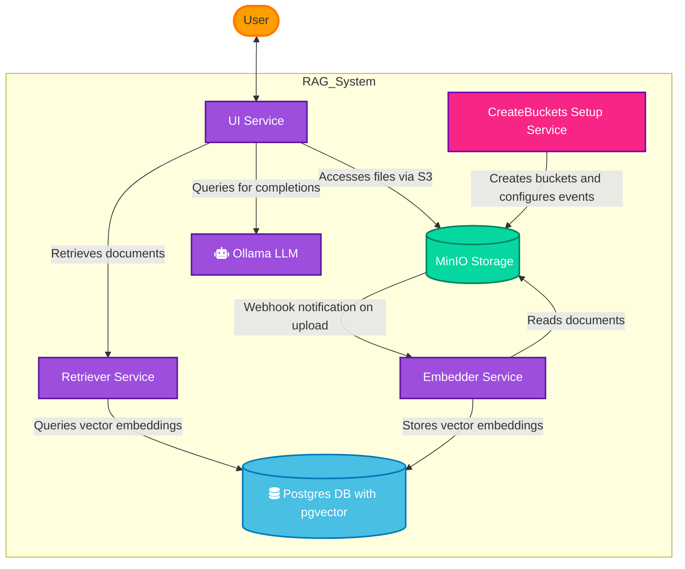

<p align="center">

</p>
<h1 align="center">
RAG-DOCS
</h1>
<p align="center">
Chat with your documents using AI-powered search 
<p>

# Table of content

<details>
<summary>Expand contents</summary>

- [About](#about)
- [Architecture](#architecture)
- [Getting Started](#getting-started)
  - [Requirements](#requirements)
  - [Installation](#installation)
  - [Configuration](#configuration)
  - [Running the system](#running-the-system)

</details>

## About

RAG-DOCS is a document search engine that uses AI to provide completions for your queries. It uses the RAG (Retrieval Augmented Generation) architecture to provide completions for your queries. The system is designed to be modular and scalable.

## Stack used

- [Gradio](https://www.gradio.app/) - Provides the user interface for chat interactions and document uploading
- [MinIO](https://min.io/) - Object storage for document files and management of document persistence
- [Postgres](https://www.postgresql.org/) - Database with vector extension to store and query document embeddings
- [FastAPI](https://fastapi.tiangolo.com/) - Backend framework for the retriever and embedder microservices
- [LlamaIndex](https://www.llamaindex.ai/) - Framework for connecting LLMs with external data through indexing
- [Ollama LLM](https://ollama.com/) - Local large language model provider for generating responses
- [OpenAI](https://openai.com/) - Alternative cloud-based language model provider for text generation and embeddings

## Architecture



### Communication Flow

1. **User Interaction**:
   - Users interact with the system through the UI service (Gradio)

2. **Document Processing**:
   - New documents are uploaded to MinIO storage
   - MinIO sends webhook notifications to the Embedder service
   - Embedder creates vector embeddings and stores them in the Postgres database

3. **Query Processing**:
   - UI sends queries to the Retriever service when chat is initiated
   - Retriever performs vector similarity search in Postgres
   - UI sends prompts to Ollama LLM along with retrieved context
   - Ollama returns generated responses to the UI

### Service Interfaces

| Service | Interface Port |
|---------|---------------|
| UI Service | 3000 |
| Retriever Service | 6000 |
| Embedder Service | 5000 |
| Postgres | 5432 |
| MinIO | 9000, 9001 |
| Ollama LLM | 11434 |


## Getting Started

### Requirements

- Docker

### Running the system

1. Clone the repository

```bash
git clone https://github.com/daviaraujocc/rag-docs && cd rag-docs
```

2. Start the system

```bash
docker-compose up -d
```

> Note: You need to setup the nvidia runtime for GPU support. Check the [official documentation](https://docs.docker.com/config/containers/resource_constraints/#access-an-nvidia-gpu) for more information.

If you have OpenAI API key, you can use the docker-compose.openai.yaml.

```bash
docker-compose -f docker-compose.openai.yaml up -d
```

3. Access the UI at [http://localhost:3000](http://localhost:3000)